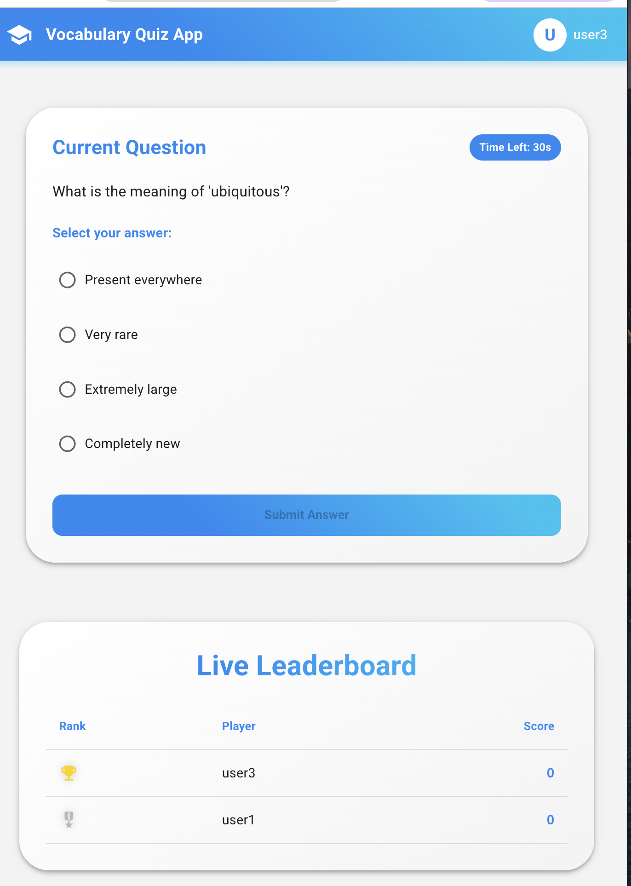

# AI Collaboration Document

Tools:

- Claude Sonet 4
- ChatGPT (free version)
- Cursor (based on Claude Sonet 4 model)

## Plan the timeline to finish in 2-3 days

Include (Research, System Design, Implementation, Document, Take presentation video)

Task:
- Use AI to help break down the project into manageable chunks
- Get AI's perspective on time estimation for each component
- Identify potential bottlenecks and dependencies

Output:
- Detailed timeline with specific tasks and milestones
- Risk assessment and mitigation strategies
- Buffer time recommendations

Prompt:
"Based on the requirements in topic.md and system-design.md, help me create a detailed 3-day timeline for implementing a real-time vocabulary quiz system. Include time for research, system design, implementation, documentation, and video presentation. Consider dependencies between tasks and potential bottlenecks."

Verify:
- Timeline is realistic and accounts for all major components
- Each day has clear deliverables
- Buffer time included for unexpected issues
- Dependencies are properly identified

## Discuss to clarify requirements and assumptions

Task:
- Use AI to analyze and break down requirements
- Get AI's perspective on potential edge cases
- Identify missing or unclear requirements

Output:
- Comprehensive list of requirements
- Documented assumptions
- List of edge cases to consider
- Questions for clarification

Prompt:
"Review the requirements in topic.md and system-design.md. Help me identify:
1. All explicit and implicit requirements
2. Potential edge cases
3. Missing or unclear requirements
4. Key assumptions we need to make
5. Questions that need clarification"

Verify:
- All requirements are clearly understood
- Assumptions are reasonable and documented
- No critical requirements are missing
- Edge cases are identified

## Research similar systems (Kahoot, Quizizz) and their traffic

Task:
- Use AI to analyze architecture of similar systems
- Get insights on scaling approaches
- Understand common patterns and anti-patterns

Output:
- Analysis of similar systems' architectures
- Common patterns and best practices
- Scaling approaches used
- Potential challenges and solutions

Prompt:
"Research and analyze the architecture of Kahoot and Quizizz, focusing on:
1. Their real-time communication approach
2. How they handle concurrent users
3. Their scaling strategies
4. Common patterns they use
5. Potential challenges they face"

Verify:
- Research covers all major components
- Findings are relevant to our requirements
- Best practices are identified and documented
- Analysis is comprehensive

## Propose the architecture from all requirement context

Task:
- Use AI to help design system architecture
- Get feedback on component interactions
- Validate scaling approaches

Output:
- System architecture diagram
- Component descriptions
- Data flow diagrams
- Scaling strategies

Prompt:
"Based on our requirements and research, help me design a system architecture for a real-time vocabulary quiz system. Include:
1. Component diagram
2. Data flow between components
3. Scaling strategies for each component
4. Monitoring and observability plan
5. Security considerations"

Verify:
- Architecture meets all requirements
- Components are properly defined
- Data flows are clear and efficient
- Scaling approach is feasible

## Collect needed knowledge

Task:
- Use AI to research technical implementations
- Get code examples and best practices
- Understand potential challenges

Output:
- Technical implementation guides
- Code examples
- Best practices
- Potential challenges and solutions

Prompt:
"Help me understand the technical implementation details for:
1. FastAPI WebSocket implementation
2. Redis Pub/Sub patterns
3. React.js real-time updates
4. Load balancing for WebSocket servers
5. Common challenges and solutions"

Verify:
- Technical knowledge is sufficient for implementation
- Best practices are identified
- Potential challenges are documented
- Solutions are practical

## Discuss and propose about scale up every component

Task:
- Use AI to analyze scaling requirements
- Get recommendations for each component
- Understand monitoring needs

Output:
- Scaling strategies for each component
- Monitoring requirements
- Performance metrics
- Alert thresholds

Prompt:
"Help me design scaling strategies for each component:
1. API servers
2. WebSocket servers
3. Databases
4. Redis cache
5. Load balancers
Include monitoring requirements and performance metrics."

Verify:
- Scaling strategies are feasible
- Monitoring plan is comprehensive
- Performance metrics are defined
- Alert thresholds are reasonable

## Generate Naive Demo based on Designed System context

Task:
- Use AI to generate initial code structure
- Get implementation guidance
- Understand testing approaches

Prompt:
```python
"""
Help me create a naive demo of the system with the following structure and requirements:

System Architecture Context:
- Basic FastAPI setup with WebSocket support
- Simple in-memory storage (no database yet)
- Basic WebSocket connections for real-time leaderboard features
- Simple UI in a file index.html only

Specific Requirements (review from system-design.md):
  - Add participant (mocked data)
  - Change score of any participant
  - Real-time leaderboard

Technical Constraints:
- Simple input validation
- Focus on core functionality first

Deliverables:
1. WebSocket event handlers
2. In-memory data structures
3. Basic API endpoints
4. Basic leaderboard functionality

Code Structure:
- FastAPI server in main.py file only
- UI
- Basic function documentation
- Focus on core features
- Use async/await for WebSocket

Please provide a implementation focusing on core functionality.
"""
```

Output:
- Basic WebSocket server implementation
- Simple quiz flow
- Basic leaderboard functionality
- Useful to test the acceptability first before designing the high-scale coding structure

Verify:
- Basic functionality works
- Real-time updates are working
- Performance is acceptable
- Issues are documented

## Generate Client side by React.js based on Designed System and naive demo context

Task:
- Use AI to generate React.js components
- Get UI/UX recommendations
- Understand state management

Output:
- React.js frontend implementation
- UI components
- State management setup



Prompt:
"Help me implement the React.js frontend with:
2. Quiz interface components
3. Leaderboard display
4. Error handling and loading states
Include code examples and best practices."

Verify:
- UI is responsive and user-friendly
- Real-time updates work correctly
- Error handling is robust
- Performance is good

## Generate some parts of Server side by FastAPI based on Designed System, naive demo and my structure as context
Pre-task (not AI):
- Create a structure for backend

Task:
- Use AI to generate FastAPI endpoints
- Get database integration guidance
- Understand WebSocket implementation

Prompt:
```python
"""
Help me implement the FastAPI server with the following structure and requirements:

System Architecture Context (review from system-design.md):
- Microservices architecture using FastAPI
- PostgreSQL database with Redis for caching
- WebSocket connections for real-time features
- Docker containerization
- RESTful API structure

Specific Requirements (review from system-design.md):
- Support up to 100 concurrent users per quiz room
- Real-time features: live scoring, participant answers, timer synchronization
- Quiz data: multiple choice questions with 4 options, 30-second time limits
- Persistent storage of quiz results and user progress
- Admin controls: start/pause/end quiz, kick participants

Technical Constraints:
- Use existing database schema (User, Quiz, Question, Answer tables)
- Follow current error handling patterns
- Implement rate limiting for API endpoints
- Include input validation and sanitization
- Write clean, commented code following current project conventions

Deliverables:
1. Main quiz controller with room management logic
2. WebSocket event handlers for real-time communication
3. Database models/queries for quiz operations
4. API endpoint definitions with proper middleware
5. Error handling and logging implementation
6. Use FastAPI with Tortoise ORM
7. Use Redis Pub/Sub for the leaderboard broadcast part

Code Structure:
- Organize code into separate modules (api, services, models) as shown in the backend folder structure
- Include proper comments for functions
- Follow RESTful naming conventions
- Use async/await for database operations

Please provide implementation details for each component following the existing project structure.
"""
```

Output:
- HTTP endpoints
- WebSocket endpoints
- Database integration
- Redis integration

Verify:
- All endpoints work correctly
- Real-time features function properly
- Error handling is comprehensive
- Performance meets requirements

## Continuous refactor, review, recorrect Server side by FastAPI based on target structure

Task:
- Use AI to review and optimize code
- Get performance improvement suggestions
- Understand best practices

Output:
- Optimized code
- Performance improvements
- Better error handling
- Comprehensive logging

Prompts:
"Help me refactor and optimize the FastAPI server:
1. Code quality improvements
2. Performance optimizations
3. Error handling enhancements
Include specific code changes and explanations."

Verify:
- Integration test to ensure requirements are correct
- Code follows best practices
- Performance is optimized
- Error handling is correct
- Remove redundant code or 

## Generate Demo data base on scenario

Task:
- Use AI to generate realistic test data
- Get test case scenarios
- Understand edge cases

Output:
- Sample quiz data
- Test user accounts
- Scoring scenarios
- Test cases

Prompt:
"Help me generate realistic demo data including:
1. Sample quiz questions and answers
2. Test user accounts
3. Various scoring scenarios
4. Edge cases to test
Include data generation scripts and test cases."

Verify:
- Data is realistic
- Test cases cover all scenarios
- Edge cases are included
- Data generation is automated

## Support to generate document

Task:
- Use AI to help write documentation
- Get presentation structure suggestions
- Understand documentation best practices

Output:
- API documentation
- Setup instructions
- Architecture documentation
- User guide
- Presentation materials

Prompt:
"Help me create comprehensive documentation including:
1. API documentation
2. Setup instructions
3. Architecture decisions
4. User guide
5. Presentation structure
Include templates and best practices."

Verify:
- Documentation is clear and complete
- Setup instructions work
- Architecture decisions are well-documented
- User guide is helpful 