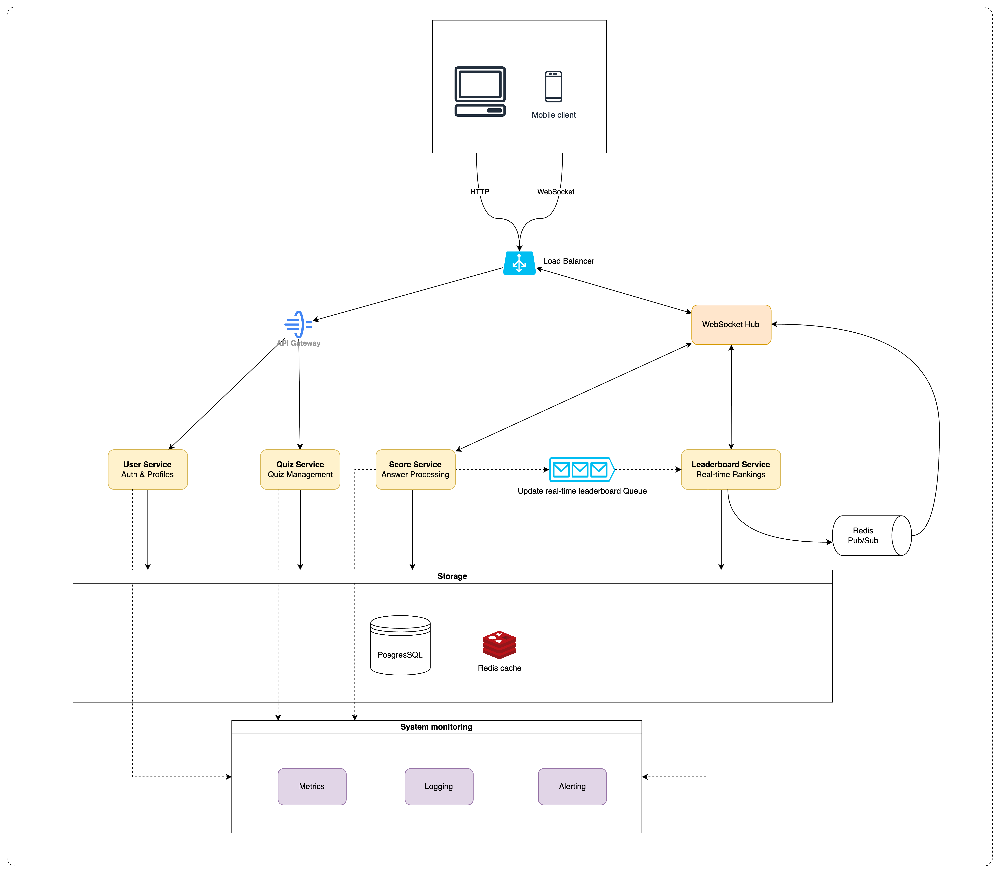

# ELSA - challenge

Topic: https://github.com/elsa/coding-challenges

# A. Understand the problems & indicate design scope.

More assumptions:

- Metric to evaluate score:
- All questions are single selection with maximum of 4 options (A, B, C, D)
- 1 point per correct answer
- The quiz creator can upload picture for each question
- Real-time quiz visualization to show the current question for participants:
    - The live quiz will change real time after user submit an answer

### Functional Requirements:

1. **User Participation**:
- Users should be able to join a quiz session using a unique quiz ID.
- The system should support multiple users joining the same quiz session simultaneously.
1. **Real-Time Score Updates:**
- As users submit answers, their scores should be updated in real time.
- The scoring system must be accurate and consistent
- After the user submit an answer, the new score and next question info will be update in real time
- Metric to evaluate score:
- All questions are selection with single multiple options
- 1 point per correct answer
1. **Real-Time Leaderboard**
- A leaderboard should display the current standings of all participants.
- The leaderboard should update promptly as scores change.
1. **Quiz Management**
- User can create/view/update/delete a quiz.

### Non-functional requirement

- The system support a total of 100 million users
- The system allows 10,000 daily active users (DAU).
- The system allows 1000 concurrent quizzes.
- The system allows up to 500 simultaneous participants per quiz
- —> The system allows 500,000 concurrent participants.

# B. System Design

- Architecture Diagram and Components Description
- API design
- Data model
- Data Flow
- How to scale the system?

## Architecture & Components

### Architecture diagram

### **Load balancer**

The load balancer sits in front of the RESTful API servers and the stateful, bi-directional
WebSocket servers. It distributes traffic across those servers to spread out load evenly.

### RESTful API servers

This is a cluster of stateless HTTP servers that handles the typical request/response traffic. Include User Service and Quiz Service.

This API layer handles auxiliary tasks like adding/removing/start quizzes, updating user profiles, etc.

### WebSocket servers

This is a cluster of stateful servers that handles the near real-time update of Leaderboard, Personal Scoring and Live Quiz. Each client maintains one persistent WebSocket connection to one of these servers.

When there is a scoring update from a participant who is within the quiz, the update is sent on this connection to the client.
When the host starts the quiz or move to the next question. It seeds the clients who join the quiz to update live quiz visualization

When a participant submits an answer, it checks the result and update the personal score immediately.

Include Scoring Service and Leaderboard Service. The Scoring Service and Leaderboard Service communicate through an event-driven pattern using a message queue (Redis Pub/Sub in this case). Here's how it works:

1. **Scoring Service**:
   - Processes answer submissions and calculates scores
   - Publishes scoring events to Redis Pub/Sub channels
   - Each quiz has its own channel (e.g., "quiz:{quiz_id}:scoring")
   - Events include: user_id, quiz_id, question_id, score, timestamp

2. **Leaderboard Service**:
   - Subscribes to scoring event channels
   - Receives real-time scoring updates
   - Recalculates rankings based on new scores
   - Updates the leaderboard cache
   - Broadcasts leaderboard updates to all participants

This event-driven architecture provides several benefits:
- Decouples scoring and leaderboard logic
- Enables asynchronous processing
- Improves scalability by allowing independent scaling of services
- Ensures eventual consistency of leaderboard data
- Reduces direct dependencies between services

The message queue acts as a buffer, handling temporary spikes in scoring events and ensuring no updates are lost even during high load.

### Redis cache for Leaderboard and Quiz

Redis is used to store the most recent quiz info, leaderboard data for each active user. There is a Time to Live (TTL) set on each entry in the cache. When the TTL expires, the user is no longer active or the quiz is ended and the data is expunged from the cache. Every update refreshes the TTL.
Other Key-Value (KV) stores that support TTL could also be used.

### User & Quiz database

The user database stores user data and Quiz data. Either a relational database
or a NoSQL database can be used for this.

I choose relational database because that effective in management

### Scoring database

This database store scoring data of participants for the quiz. These data can be use in statistic later

I choose relational database because that effective in management

### Redis Pub/Sub server

Redis Pub/Sub is a very lightweight message bus. Channels in Redis Pub/Sub are very cheap to create. A modern Redis server with GBs of memory could hold millions of channels (also called topics). 

In this design, scoring updates received via the WebSocket server are published to the
quiz's own channel in the Redis Pub/Sub server. A dedicated WebSocket connection handler for each active quiz subscribes to the channel. When there is a scoring update, the WebSocket handler function gets invoked, and for each leaderboard, the function recomputes the score and rank. The new score and range sets are sent via the WebSocket connection to the participant's client.

Other message buses with lightweight channels could also be used.

### System mornitoring

To ensure the system's reliability and performance, we implement comprehensive monitoring:

1. **Application Monitoring**:
   - Use Prometheus for metrics collection
   - Grafana for visualization and dashboards
   - Monitor key metrics:
     - WebSocket connection count
     - API response times
     - Error rates
     - Active quiz sessions
     - Concurrent users

2. **Infrastructure Monitoring**:
   - Monitor server health (CPU, memory, disk usage)
   - Network latency and throughput
   - Load balancer metrics
   - Redis cache hit/miss rates
   - Database performance metrics

3. **Alerting**:
   - Set up alerts for critical metrics
   - Define thresholds for:
     - High error rates
     - Slow response times
     - Resource exhaustion
     - Connection failures

4. **Logging**:
   - Centralized logging using ELK stack (Elasticsearch, Logstash, Kibana)
   - Structured logging for better analysis
   - Log levels appropriate for different environments

## API Design

### **WebSocket**

Users send and receive location updates through the WebSocket protocol.
At the minimum, we need the following APIs

1. Web socket init (join the quiz)
    
    Request: Client sends user ID, quiz ID
    
    Response: First question data
    
2. Submit answer for a question
    
    Request: Client sends user ID, quiz ID, question ID, question's answer
    
    Response: question result data, scoring data, next question data
    
3. Client receives leaderboard updates
    
    Data sent: Latest leaderboard data
    

### HTTP requests:

| Service | Method | Endpoint | Request |
| --- | --- | --- | --- |
| User | POST | /users/register | Register new user account |
| User | POST | /users/login | Authenticate user and get access token |
| User | POST | /users/refresh-token | Get new access token using refresh token |
| User | POST | /users/logout | Invalidate current session |
| User | GET | /users/profile | Get current user profile |
| User | PUT | /users/profile | Update user profile information |
| User | POST | /users/upload-avatar | Upload user profile picture |
| User | POST | /users/quizzes/{quizId}/join | Check and Join a quiz session. Create personal quiz and update leaderboard caches |
| Quiz | GET | /quizzes | Get list of all quizzes |
| Quiz | GET | /quizzes/{quizId} | Get specific quiz details |
| Quiz | POST | /quizzes | Create new quiz |
| Quiz | PUT | /quizzes/{quizId} | Update existing quiz |
| Quiz | DELETE | /quizzes/{quizId} | Delete a quiz |
| Quiz | POST | /quizzes/{quizId}/start | Start a quiz session |

## Data model

Another important element to discuss is the data model. We already talked about the
User DB in the high-level design, so let's focus on the Leaderboard cache, Quiz session cache and location history database.

### **Quiz database**

Quiz table

| quiz_Id | title | description | status (DRAFT, STARTED, ENDED) |
| --- | --- | --- | --- |

Question table

| question_id | quiz_Id | title | answer_description | correct_answer (A, B, C, D) |
| --- | --- | --- | --- | --- |

Answer table

| answer_id | question_id | order | description | is_correct_answer (TRUE/FALSE) |
| --- | --- | --- | --- | --- |

### **Scoring database**

| user_id | quiz_Id | question_id | start_time | finish_time | answer_id | score |
| --- | --- | --- | --- | --- | --- | --- |

### **Quiz session cache**

Technology/Tool: Redis

Using regex with prefix "quiz:{user_id}:{quiz_id}" to get all question info for each user's quiz session

| **key** | **value** |
| --- | --- |
| quiz:{user_id}:{quiz_id}:{question_id} | {question_id, title, answers: [{answer_id, description}], submitted_answer_id, correct_answer_id, score} |

### **Leaderboard cache**

Technology/Tool: Redis

Using regex with prefix "leaderboard:{quiz_id}" to get all part of the leaderboard

| **key** | **value** |
| --- | --- |
| leaderboard:{quiz_id}:{user_id} | {rank, user_name, score} |

## Data flow

### Participant joins a quiz

1. The Participant client sends a HTTP request to join the quiz with quiz ID.
2. The load balancer forwards the answer to the persistent connection on the
WebSocket server for that client to evaluate score
3. API servers check the permission then save the joining status
4. API servers response to the client
5. Client send the request to initialize the joining session via WebSocket connection
6. The load balancer forwards the answer to the persistent connection on the
WebSocket server for that client to initialize joining connection.
7. The WebSocket server updates the new scoring and leaderboard in the Redis Cache

### Realtime Scoring update

Participant submit an answer —> Real-time scoring update

1. The Participant client sends a submit question's answer to the load balancer.
2. The load balancer forwards the answer to the persistent connection on the
WebSocket server for that client to evaluate score.
3. WebSocket server process the score evaluation then response the answer result to the client (include the next question data).

### Realtime leaderboard update

Participant submit an answer —> Real-time leaderboard for all quiz's participants

Participant submit question's answer over the persistent WebSocket connection.

1. The Participant client sends a submit question's answer to the load balancer.
2. The load balancer forwards the answer to the persistent connection on the
WebSocket server for that client to evaluate score.
3. The WebSocket server saves the scoring data to the Scoring database.
4. The WebSocket server updates the new scoring and leaderboard (score, rank) in the Quiz and Leaderboard cache. The update refreshes the TTL.
5. The WebSocket server publishes the new leaderboard update to the user's channel in the Redis Pub/Sub server. Steps 2.1, 3, 4, 5 can be executed in parallel.
6. When Redis Pub/Sub receives a scoring update on a channel, it broadcasts the update
to all the subscribers (WebSocket connection handlers). In this case, the subscribers
are all the leaderboard associate with the quiz which the user submitting the answer. For each subscriber (i.e., for each of the participant's leader), its WebSocket connection handler would receive the user scoring update.
7. On receiving the message, the WebSocket server, on which the connection handler
lives, update the its leaderboard

## How to scale the system?

### API servers

The methods to scale the RESTful API tiers are well understood. These are stateless
servers, and there are many ways to auto-scale the clusters based on CPU usage, load, or
I/O.

Tool: Kubernetes

### WebSocket servers

The WebSocket servers are stateful, so care must be taken when removing existing nodes.
Before a node can be removed, all existing connections should be allowed to drain.

We can mark a node as "draining" at the load balancer so that no new Weh,
Socket connections will be routed to the draining server.

Effective auto-scaling of stateful servers is the job of a good load
balancer. Most cloud load balancers handle this job very well.

Tool: AWS ALB/NGINX

### User, Quiz, Scoring database

For scaling the databases, we have some strategies to follow:

1. **Database Sharding**:
   - Shard by quiz_id for the Quiz database
   - Shard by user_id for the User database
   - Shard by quiz_id for the Scoring database
   - Use consistent hashing for shard distribution

2. **Read Replicas**:
   - Implement read replicas for each shard
   - Use for read-heavy operations
   - Helps distribute read load

3. **Connection Pooling**:
   - Implement connection pooling to manage database connections
   - Optimize connection reuse
   - Set appropriate pool sizes based on load

4. **Indexing Strategy**:
   - Create appropriate indexes for frequently queried fields
   - Use composite indexes for common query patterns
   - Regular index maintenance and optimization

5. **Caching Layer**:
   - Implement application-level caching
   - Cache frequently accessed data
   - Use Redis for caching with appropriate TTL

6. **Database Maintenance**:
   - Regular vacuuming and optimization
   - Archival strategy for old data
   - Backup and recovery procedures

### Redis Pub/Sub server

# C. Wrap Up

Some of the core components include

- WebSocket: real-time communication between clients and the server.
- Redis cache: fast read and write of quiz, scoring and leaderboard data.
- Redis Pub/Sub: routing layer to direct scoring updates from one participant to all associated leaderboards.

We first came up with a high-level design at a lower scale and then discussed challenges
that arise as the scale increases. We explored how to scale the following:

- RESTful API servers
- WebSocket servers
- Data layer
- Redis Pub/Sub servers

Finally, we discussed potential bottlenecks when a quiz has many participants and there are many active quizzes at one time.

## Future improvement ideas

1. Authorization: (admin/teacher/student/etc.)
    - Only an admin or teacher can create a quiz.
2. Random question order
3. Random answer order for each question
4. More complex metric to evaluate score: based on response time, correct streak, question weight, etc.
5. Use CDN to support images, attached files for question information

[AI Collaboration Document](https://www.notion.so/AI-Collaboration-Document-210a4e3d34f380e89879d7debfc510f7?pvs=21)